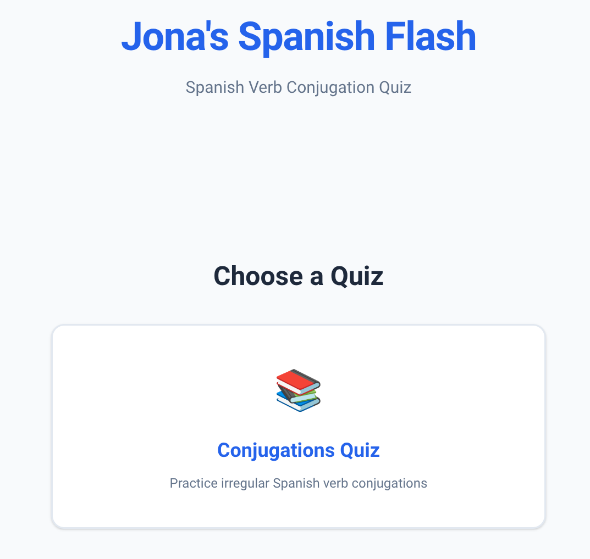
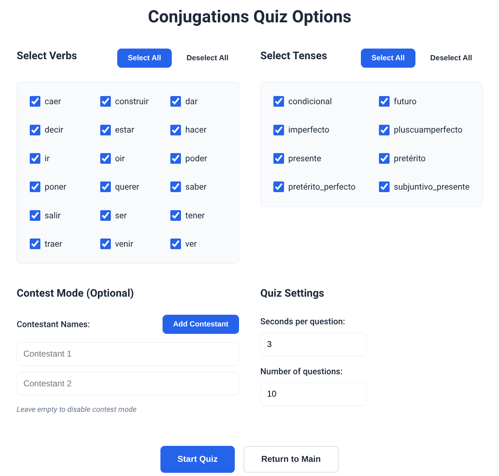
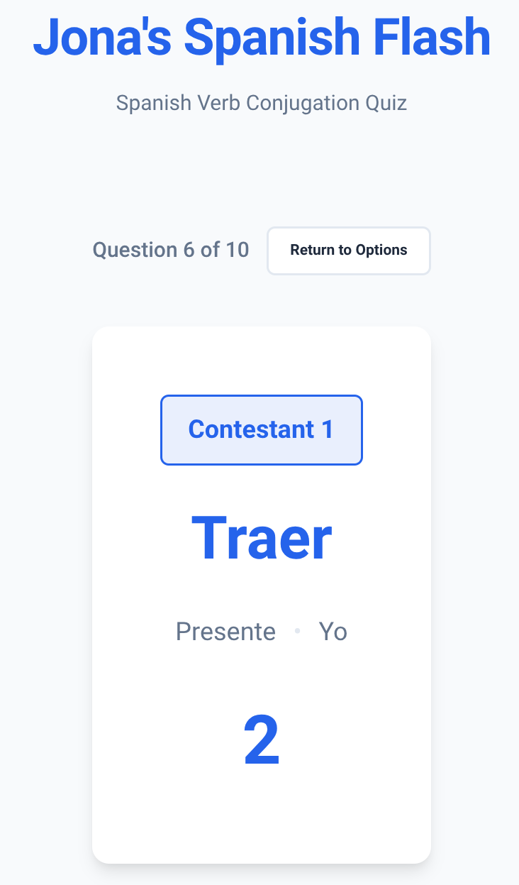
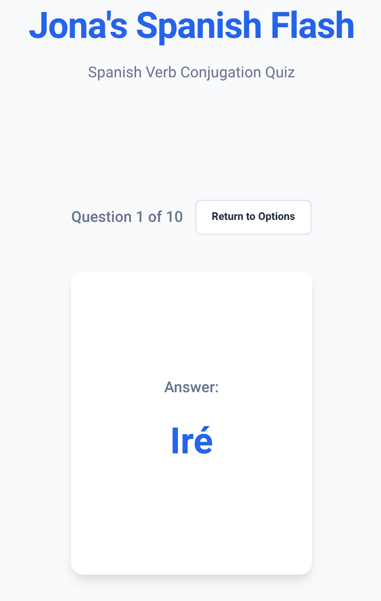

# Jona's Spanish Quiz - Spanish Learning Apps

A Flask web application for practicing Spanish through interactive flashcard-style quizzes. The app includes three different quiz types: verb conjugations, por vs para usage, and vocabulary training.

## Features

### Conjugations Quiz
- Practice irregular Spanish verb conjugations across multiple tenses
- Choose specific verbs and tenses to practice
- Customizable timing and number of questions
- Contest mode for competitive practice

### Por vs Para Quiz
- Practice choosing between "por" and "para" in context
- Select from different usage categories (motivation, duration, destination, goal, etc.)
- Sentence-based questions with answer display showing complete sentences
- Customizable timing and number of questions
- Contest mode support

### Vocabulary Quiz
- Train vocabulary with German and English translations
- Select from available vocabulary sets (currently: Por/Para Vocabulary)
- Choose translation direction:
  - Spanish → German
  - Spanish → English
  - German → Spanish
  - English → Spanish
- Customizable timing and number of questions
- Contest mode support

### Common Features
- **Flashcard Style**: Questions displayed for a set time, followed by answers
- **Configurable Timing**: Set seconds per question and seconds per answer
- **Skip Button**: Skip remaining answer time to move to next question
- **Settings Persistence**: All preferences are saved and restored automatically
- **Contest Mode**: Assign questions to multiple contestants for competitive practice
- **Data Validation**: Ensures consistency across all data files
- **Responsive Design**: Optimized for both desktop and mobile devices

## Screenshots

### Main Page


### Options Page


### Quiz - Question Display


### Quiz - Answer Display


## Project Structure

```
spanisch-flash/
├── app.py                 # Flask application entry point
├── pyproject.toml        # uv project configuration
├── .gitignore            # Git ignore rules
├── README.md             # Project documentation
├── LICENSE               # MIT License
├── data/
│   ├── conjugations.json  # Verb conjugation data
│   ├── por_para.json      # Por/para sentence data
│   └── vocabulary.json    # Vocabulary data with translations
├── utils/
│   └── data_validator.py  # Data consistency validation
├── templates/
│   ├── base.html         # Base template with navigation
│   ├── index.html        # Main page (quiz selection)
│   ├── options.html      # Conjugations quiz options page
│   ├── quiz.html         # Conjugations quiz page
│   ├── por_para_options.html  # Por/para quiz options page
│   ├── por_para_quiz.html     # Por/para quiz page
│   ├── vocab_options.html      # Vocabulary quiz options page
│   └── vocab_quiz.html         # Vocabulary quiz page
└── static/
    ├── css/
    │   └── style.css     # Custom styling
    └── js/
        └── quiz.js       # Quiz timing logic
```

## Setup Instructions

### Prerequisites

- Python 3.10 or higher
- [uv](https://github.com/astral-sh/uv) package manager

### Installation

1. Clone the repository:
```bash
git clone <repository-url>
cd spanisch-flash
```

2. Create a virtual environment and install dependencies using uv:
```bash
uv venv
source .venv/bin/activate  # On Windows: .venv\Scripts\activate
uv pip install -e .
```

3. Run the application:
```bash
python app.py
```

4. Open your browser and navigate to `http://localhost:5000`

## Usage

### Main Page
Select the quiz type you want to practice:
- **Conjugations Quiz**: Practice irregular Spanish verb conjugations
- **Por vs Para Quiz**: Practice choosing between por and para
- **Vocabulary Quiz**: Train vocabulary with translations

### Options Pages
Each quiz has its own options page where you can configure:

**Conjugations Quiz:**
- Choose which irregular verbs to practice (select/deselect all buttons available)
- Select which tenses to include (select/deselect all buttons available)
- Contest mode (optional)
- Seconds per question (default: 3 seconds)
- Seconds per answer (default: 4 seconds)
- Number of questions (default: 10)

**Por vs Para Quiz:**
- Select Por categories (motivation/reason, duration, cost/price, etc.)
- Select Para categories (destination, goal, recipients, etc.)
- Contest mode (optional)
- Seconds per question (default: 7 seconds)
- Seconds per answer (default: 4 seconds)
- Number of questions (default: 10)

**Vocabulary Quiz:**
- Select vocabulary sets to practice (currently: Por/Para Vocabulary)
- Choose translation direction (Spanish→German, Spanish→English, German→Spanish, English→Spanish)
- Contest mode (optional)
- Seconds per question (default: 5 seconds)
- Seconds per answer (default: 4 seconds)
- Number of questions (default: 10)

### Quiz Pages
- Each question displays according to the quiz type
- In contest mode, the assigned contestant name is shown above the question
- A countdown timer shows the remaining time
- After the set time, the correct answer is displayed
- Use "Show next question" button to skip remaining answer time
- Use "Return to Options" button to exit the quiz early
- After completing all questions, you'll return to the options page with your settings preserved

Your settings are automatically saved and will be restored when you return to the options page.

## Data Structure

### Conjugations Data
Stored in `data/conjugations.json`:
```json
{
  "conjugations_quiz": {
    "verb_name": {
      "tense_name": {
        "yo": "conjugation",
        "tu": "conjugation",
        "el/ella/usted": "conjugation",
        "nosotros": "conjugation",
        "vosotros": "conjugation",
        "ellos/ellas/ustedes": "conjugation"
      }
    }
  }
}
```

### Por/Para Data
Stored in `data/por_para.json`:
```json
{
  "por": {
    "category_name": [
      "Sentence with _____ placeholder",
      ...
    ]
  },
  "para": {
    "category_name": [
      "Sentence with _____ placeholder",
      ...
    ]
  }
}
```

### Vocabulary Data
Stored in `data/vocabulary.json`:
```json
{
  "vocab_sets": {
    "set_name": [
      {
        "spanish": "word",
        "german": "Wort",
        "english": "word"
      },
      ...
    ]
  }
}
```

## Development

The application includes data validation that runs on startup to ensure:
- All verbs have all tenses with all 6 person forms
- All por/para categories have at least 10 sentences with placeholders
- All vocabulary entries have Spanish, German, and English translations
- No duplicate entries within vocab sets
- Data consistency across the entire dataset

## License

This project is licensed under the MIT License - see the [LICENSE](LICENSE) file for details.
